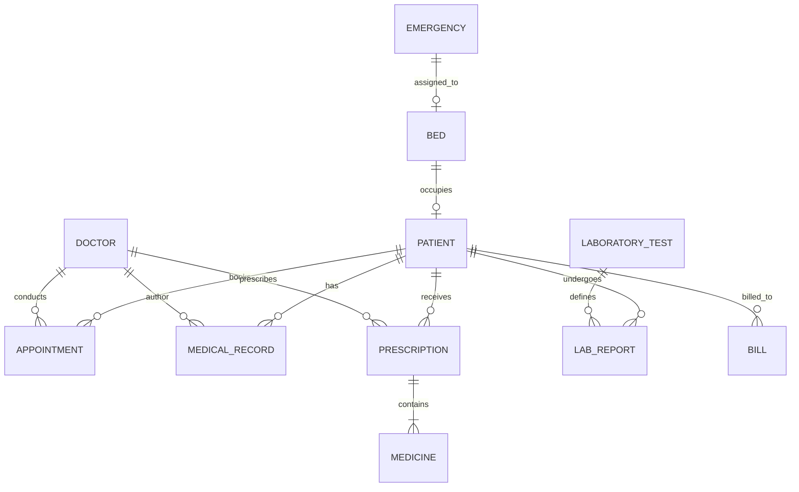

# Smart Hospital Management System (SHMS)
**Final Year College / University Project**  
*Full-Stack Python Web Application with Flask, Modern Vanilla Frontend, and Thread-Safe JSON Engine*

---

## 🌟 Executive Overview
The **Smart Hospital Management System (SHMS)** is an Enterprise Resource Planning (ERP) platform modeling complete healthcare operations. It delivers modern clinical workflows across **7 distinct Role-Based Access Control (RBAC) tiers**, including:
- **Admin:** Master oversight, bed census, financial ledgers, audit logging.
- **Doctor:** OPD queue, electronic health records (EHR), prescription composer, diagnostic test orders.
- **Nurse:** Inpatient care, vitals monitoring, bed allocation and patient discharge.
- **Receptionist:** Patient master index registration, live doctor slot availability checking, token scheduling.
- **Laboratory:** Diagnostic orders queue, clinical pathology findings entry, report sign-off.
- **Pharmacy:** Medicine inventory, automated low-stock warnings, 30-day expiration alerts, prescription dispensing with stock decrement.
- **Patient:** Self-service portal for upcoming appointments, medication schedules, diagnostic reports, and instant bill payment.

---

## 🏗️ System Architecture & Directory Layout

```text
Hospital system/
├── app.py                      # Flask Application, Routing, and REST API Endpoints
├── requirements.txt            # Python Dependencies (Flask, FileLock, Werkzeug)
├── seed_db.py                  # Database Seeder (Populates 15 JSON files with hashed accounts)
├── test_system.py              # Automated End-to-End Test Suite (9 Verification Modules)
├── README.md                   # Complete Documentation & Academic Algorithm Manual
│
├── helpers/
│   ├── json_db.py              # Thread-safe & Process-safe JSON Engine (FileLock + Atomic Writes)
│   ├── auth.py                 # RBAC Decorators (@login_required, @role_required)
│   └── emergency_logic.py      # Rule-Based Smart Emergency Priority & Triage Engine
│
├── data/                       # File-based JSON Database (Auto-initialized)
│   ├── users.json              # System Credentials (Werkzeug Hashed Passwords)
│   ├── patients.json           # Patient Demographics & Medical History
│   ├── doctors.json            # Physician Profiles, Schedules, and OPD Fees
│   ├── nurses.json             # Nursing Staff & Assigned Wards
│   ├── staff.json              # Reception, Lab, and Pharmacy Personnel
│   ├── appointments.json       # Scheduled Consultations & Sequential OPD Tokens
│   ├── medical_records.json    # Clinical Diagnoses, Vitals, and Physician Notes
│   ├── prescriptions.json      # Electronic Prescriptions & Itemized Costs
│   ├── medicines.json          # Pharmacy Stock, Reorder Thresholds, and Expiry Dates
│   ├── laboratory_tests.json   # Diagnostic Procedures Catalog
│   ├── lab_reports.json        # Test Orders, Clinical Findings, and Sign-offs
│   ├── beds.json               # Ward Bed Inventory (ICU, Emergency, General, Private)
│   ├── bills.json              # Itemized Hospital Invoices & Payment Ledger
│   ├── emergency.json          # Triage Records & Priority Classifications
│   └── activity_logs.json      # System Audit Log Records
│
├── templates/                  # Role-Tailored HTML5 ERP Dashboards
│   ├── index.html              # Modern Public Hospital Landing Page
│   ├── login.html              # Central Login with 1-Click Role Demonstrators
│   ├── admin_dashboard.html    # Executive Hospital Administration Console
│   ├── doctor_dashboard.html   # Clinical Consultation & E-Prescribing Desk
│   ├── nurse_dashboard.html    # Ward Bed Monitoring & Patient Census
│   ├── receptionist_dashboard.html # Front Desk Registration & Token Scheduling
│   ├── laboratory_dashboard.html   # Diagnostic Lab Orders & Pathology Catalog
│   ├── pharmacy_dashboard.html # Pharmaceutical Inventory & Expiry Watcher
│   └── patient_dashboard.html  # Patient Self-Service Health Hub
│
└── static/
    ├── css/
    │   └── style.css           # Medical ERP Design System, KPI Cards, Modals, Print Styles
    └── js/
        ├── auth.js             # Authentication & 1-Click Demo Fillers
        ├── dashboard.js        # Analytics Aggregator, Alert Monitor & Activity Feed
        ├── patients.js         # Patient Live Search & Medical Dossier Drawer
        ├── appointments.js     # Real-time Doctor Slot Checker & Token Generator
        ├── medical.js          # Doctor Consultation, Prescription Composer, Lab & Pharmacy Logic
        └── billing.js          # Multi-Factor Billing Engine & Printable Invoice Generator
```

---

## ⚡ Quick Start Guide

### 1. Prerequisites & Installation
Ensure Python 3.10+ is installed on your computer.

```bash
# Clone or navigate to the project directory
cd "c:\Users\iNDIA\Desktop\Hospital system"

# Install dependencies
pip install -r requirements.txt
```

### 2. Seed Baseline Data
To initialize all 15 JSON databases with interconnected mock data and hashed credentials:

```bash
python seed_db.py
```

### 3. Run Automated Tests
Verify all API endpoints, RBAC permissions, and algorithmic rule engines:

```bash
python test_system.py
```

### 4. Start the Application
Run the Flask server:

```bash
python app.py
```

Open your browser and navigate to:  
👉 **http://127.0.0.1:5000**

---

## 🔑 Default Login Credentials (7 Roles)

For quick demonstration during college viva and project evaluations, the central login screen at `/login` provides **1-Click Test Login Buttons** that automatically authenticate any role without manual typing.

| Role | Username | Password | Access Scope |
| :--- | :--- | :--- | :--- |
| **Admin** | `admin` | `admin123` | Full ERP Control, Bed Census, Analytics, Billing |
| **Doctor** | `doctor_smith` | `doc123` | OPD Consultations, Medical Records, Prescriptions |
| **Nurse** | `nurse_sarah` | `nurse123` | Inpatient Care, Ward Beds, Allocation & Discharge |
| **Receptionist** | `reception_jane` | `rec123` | Patient Registration, Appointments, Token Issuance |
| **Laboratory** | `lab_tech` | `lab123` | Diagnostic Queue, Pathology Findings Entry |
| **Pharmacy** | `pharma_john` | `pharma123` | Medicine Inventory, Expiry Alerts, Dispensing |
| **Patient** | `patient_alice` | `pat123` | Personal Appointments, Rx History, Bill Payment |

---

## 🧠 Core Smart Algorithms & Mathematical Formulations

### Algorithm 1: Thread-Safe Atomic JSON Storage Engine
* **Problem Solved:** Standard `json.dump()` directly overwriting files causes corrupted data during sudden interruptions or concurrent multi-user write operations.
* **Mitigation Strategy:**
  1. Process concurrency handled via `filelock.FileLock` using `.lock` files in `data/.locks/`.
  2. Thread concurrency handled via Python's `threading.RLock()`.
  3. Writes occur in a temporary file created on the same file system via `tempfile.NamedTemporaryFile` + `os.fsync()`.
  4. File swap executed through `os.replace(temp_path, target_path)` (POSIX/NT atomic file replacement guarantee).

### Algorithm 2: Rule-Based Smart Emergency Priority & Triage Engine
Classifies incoming emergency patients automatically based on physiological vital signs:

$$\text{Priority} = f(\text{SpO}_2, \text{Systolic BP}, \text{Heart Rate}, \text{Consciousness}, \text{Trauma})$$

* **CRITICAL ($Score \ge 8$):**
  $$\text{SpO}_2 < 85\% \quad \lor \quad \text{Systolic BP} > 180 \text{ mmHg} \quad \lor \quad \text{Systolic BP} < 80 \text{ mmHg} \quad \lor \quad \text{Unconscious} \quad \lor \quad \text{Severe Trauma}$$
  * *Recommended Bed:* ICU
  * *Wait Time:* Immediate (0 minutes)
  * *Safety Trigger:* Immediate Dashboard Code Red Alert if available ICU beds = 0.
* **HIGH ($Score \in [5, 7]$):**
  $$\text{SpO}_2 \in [85\%, 92\%] \quad \lor \quad \text{Temp} > 103^\circ\text{F} \quad \lor \quad \text{Acute Severe Abdomen} \quad \lor \quad \text{Deep Bleeding}$$
  * *Recommended Bed:* Emergency Bay
  * *Wait Time:* $< 15$ minutes
* **MEDIUM ($Score \in [3, 4]$):**
  $$\text{SpO}_2 \in [93\%, 95\%] \quad \lor \quad \text{Moderate Fracture} \quad \lor \quad \text{Persistent Vomiting}$$
  * *Recommended Bed:* Emergency Bay
  * *Wait Time:* $< 45$ minutes
* **LOW ($Score \le 2$):**
  $$\text{Stable Vitals } (\text{SpO}_2 \ge 96\%, \text{Normal BP}) \quad \lor \quad \text{Mild Symptoms}$$
  * *Recommended Bed:* General Ward / Outpatient
  * *Wait Time:* $< 90$ minutes

### Algorithm 3: Automated Multi-Factor Billing Engine
Calculates the patient's comprehensive institutional charges when preparing an invoice or discharging an inpatient:

$$\text{Total Amount} = \max\left(0, \;\Big(\text{Fee}_{\text{consult}} + (\text{Rate}_{\text{bed}} \times \text{Days}_{\text{occupied}}) + \sum_{i=1}^{n} \text{Price}_{\text{lab}_i} + \sum_{j=1}^{m} (\text{Price}_{\text{med}_j} \times \text{Qty}_j)\Big) - \text{Discount}\right)$$

### Algorithm 4: Dynamic Medicine Inventory & Expiry Watcher
Evaluates stock condition in real time whenever medicines are inspected or queried:

$$\text{Stock Condition} = \begin{cases} 
\text{"EXPIRED"}, & \text{if } \text{Date}_{\text{expiry}} < \text{Date}_{\text{today}} \\
\text{"EXPIRING\_SOON"}, & \text{if } 0 \le (\text{Date}_{\text{expiry}} - \text{Date}_{\text{today}}) \le 30 \text{ days} \\
\text{"LOW\_STOCK"}, & \text{if } \text{Qty}_{\text{stock}} \le \text{Threshold}_{\text{min}} \\
\text{"IN\_STOCK"}, & \text{otherwise}
\end{cases}$$

### Algorithm 5: Dynamic OPD Doctor Slot Availability & Token Allocation
1. Fetch doctor working hours and standard slot list $S = \{s_1, s_2, \dots, s_k\}$.
2. Query `appointments.json` for active bookings matching `doctor_id` and selected `date`: $B = \{s \in S \mid s \text{ is booked and status} \ne \text{"Cancelled"}\}$.
3. Compute available open slots $A = S \setminus B$.
4. Upon confirmation, assign sequential Token Number $T = |B| + 1$.

---

## 📊 Database Design (Relational Modeling for College Evaluation)

Although persisted in optimized JSON files, the architecture strictly adheres to **Third Normal Form (3NF)** relational database theory:



### Relational Schema Summary:
1. **USERS** (`user_id` [PK], `username`, `password_hash`, `role`, `name`, `email`, `phone`, `associated_id`)
2. **PATIENTS** (`patient_id` [PK], `name`, `age`, `gender`, `blood_group`, `phone`, `email`, `address`, `emergency_contact`, `status`, `bed_id` [FK])
3. **DOCTORS** (`doctor_id` [PK], `name`, `specialization`, `department`, `opd_fee`, `room_no`, `available_slots`)
4. **APPOINTMENTS** (`appointment_id` [PK], `patient_id` [FK], `doctor_id` [FK], `appointment_date`, `time_slot`, `token_number`, `status`)
5. **BEDS** (`bed_id` [PK], `bed_number`, `ward_type`, `daily_rate`, `status`, `patient_id` [FK], `assigned_date`)
6. **MEDICAL_RECORDS** (`record_id` [PK], `patient_id` [FK], `doctor_id` [FK], `date`, `symptoms`, `diagnosis`, `vitals`, `prescription_id` [FK])
7. **PRESCRIPTIONS** (`prescription_id` [PK], `patient_id` [FK], `doctor_id` [FK], `date`, `medicines`, `total_medicine_charge`, `dispense_status`)
8. **MEDICINES** (`medicine_id` [PK], `name`, `generic_name`, `category`, `stock_quantity`, `min_threshold`, `unit_price`, `expiry_date`, `status`)
9. **LABORATORY_TESTS** (`test_id` [PK], `test_name`, `department`, `price`, `normal_range`, `sample_type`)
10. **LAB_REPORTS** (`report_id` [PK], `patient_id` [FK], `test_id` [FK], `ordered_date`, `status`, `results`, `cost`)
11. **BILLS** (`bill_id` [PK], `patient_id` [FK], `bill_date`, `consultation_fee`, `bed_charge`, `lab_charges`, `medicine_charges`, `discount`, `total_amount`, `paid_amount`, `status`)
12. **EMERGENCY** (`emergency_id` [PK], `patient_name`, `priority`, `triage_score`, `vitals`, `recommended_bed_type`, `status`)
13. **ACTIVITY_LOGS** (`log_id` [PK], `timestamp`, `user_id`, `role`, `action`, `module`)

---

## 📡 REST API Documentation

| Method | Endpoint | Access Roles | Description |
| :--- | :--- | :--- | :--- |
| `POST` | `/api/login` | Public | Authenticates credentials and starts session |
| `POST` | `/api/logout` | Authenticated | Clears session and logs audit trail |
| `GET` | `/api/patients` | All Roles | Lists patients (supports `?query=` search) |
| `POST` | `/api/patients` | Admin, Receptionist, Nurse | Registers new patient |
| `GET` | `/api/patients/<id>` | All Roles | Fetches complete dossier with history |
| `GET` | `/api/doctors` | All Roles | Lists all doctors with department filter |
| `GET` | `/api/doctors/<id>/availability` | All Roles | Returns open time slots for a given date |
| `GET` | `/api/appointments` | All Roles | Lists appointments (scoped by role) |
| `POST` | `/api/appointments` | All Roles | Books appointment & generates token |
| `PUT` | `/api/appointments/<id>/status` | Medical Staff | Updates appointment status |
| `GET` | `/api/emergency` | All Roles | Returns emergency triage queue |
| `POST` | `/api/emergency` | Medical Staff | Executes rule-based triage classifier |
| `GET` | `/api/beds` | All Roles | Returns bed census and occupancy rates |
| `POST` | `/api/beds/<id>/allocate` | Admin, Doctor, Nurse | Allocates bed to an admitted patient |
| `POST` | `/api/beds/<id>/discharge` | Admin, Doctor, Nurse | Discharges patient & frees bed |
| `POST` | `/api/medical-records` | Doctor, Admin | Records consultation, vitals, diagnosis |
| `POST` | `/api/prescriptions` | Doctor, Admin | Issues electronic prescription |
| `POST` | `/api/prescriptions/<id>/dispense` | Pharmacy, Admin | Marks Rx dispensed & deducts stock |
| `GET` | `/api/laboratory/tests` | All Roles | Diagnostic test catalog |
| `GET` | `/api/laboratory/reports` | All Roles | Laboratory reports queue |
| `PUT` | `/api/laboratory/reports/<id>/result`| Laboratory, Admin | Enters test findings and signs report |
| `GET` | `/api/medicines` | All Roles | Evaluates stock and expiry warnings |
| `GET` | `/api/billing/calculate/<pat_id>` | All Roles | Computes multi-factor itemized bill |
| `POST` | `/api/billing` | Admin, Receptionist | Generates official invoice receipt |
| `POST` | `/api/bills/<id>/pay` | Admin, Receptionist, Patient | Records payment for invoice |
| `GET` | `/api/dashboard/stats` | Authenticated | Computes aggregated KPI metrics & alerts |
| `GET` | `/api/activity-logs` | Authenticated | Retrieves recent audit trail entries |

---

## 🎓 Academic Viva & Presentation Highlights
When presenting this project to evaluators:
1. **Explain the Concurrency Solution:** Mention how Python's `FileLock` + `NamedTemporaryFile` + `os.replace` eliminates race conditions and file corruptions without needing a database daemon.
2. **Demonstrate 7 RBAC Roles:** Use the 1-click login panel on `/login` to showcase how Doctors only see their clinic desk, Pharmacists see inventory and expiration warnings, Nurses view ward census, and Patients only view their personal records.
3. **Demonstrate Smart Emergency Triage:** Enter an emergency patient with `SpO2 = 81%` and `Systolic BP = 190` to show the automated CRITICAL classification, ICU bed recommendation, and dashboard code red alert.
4. **Demonstrate Automated Billing:** Show how discharging a patient dynamically compiles consultation fees, bed rate multiplied by days occupied, pathology lab charges, and medicine prices in one mathematical calculation.
